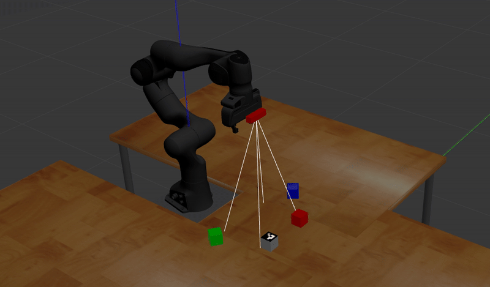

# 🤖 Franka Panda Autonomous Pick-and-Place (ROS / MoveIt! — Gazebo)

This repository implements a robust **Pick-and-Place** pipeline for the 7-DoF Franka Emika Panda robot in a Gazebo simulation, utilizing 3D vision for object detection based on **Color** and **ArUco Markers**.

<p align="center" width="100%">
    
</p>

## Key Features

The system is engineered with a modular ROS architecture, demonstrating advanced skills in software integration, motion planning, and computer vision suitable for robotics roles.

* **Dual Perception:** Object localization via:
    * **Color Segmentation (HSV):** Detection of Red, Green, and Blue cubes using OpenCV.
    * **ArUco Markers:** Robust pose estimation of complex objects via the ArUco library.
* **3D Pose Estimation:** Pose calculation using **Ray-Casting projection** onto the table plane, tightly integrated with **ROS TF transforms** for high accuracy.
* **MoveIt! Controller:** Collision-free motion planning for the complete Pick-and-Place sequence, including pre-grasp, grasp, lift, and place trajectories.
* **State Machine:** Centralized control (`pick_and_place_core.py`) that subscribes to the shared `/cube_pose_stamped` topic, manages the robot state (e.g., `is_busy`), and orchestrates the full sequence.
* **External Configuration:** All critical parameters (HSV ranges, pose offsets, joint targets, planner settings) are externalized to `config/pick_and_place_params.yaml` for easy tuning and calibration.

### Architecture Overview (ROS Graph)

The system operates via three main nodes communicating through the shared pose topic.

## Prerequisites

The project was primarily developed and tested with:
* **Operating System:** Ubuntu 20.04 LTS
* **ROS Distribution:** ROS Noetic
* **Simulation:** Gazebo 11

Required ROS dependencies include: `moveit_commander`, `gazebo_msgs`, `gazebo_ros`, `cv_bridge`, `tf`, and the Franka MoveIt configuration (`panda_moveit_config`). These are listed in `package.xml`.

## Usage

### 1. Build and Setup

Follow the standard Catkin workflow to clone and build the package (`franka_lab_dev`) in your workspace.

```bash
# Clone the repository into your catkin workspace's src folder
cd ~/catkin_ws/src
git clone [https://github.com/NazarioPizzicoli/Pick-and-place---Franka-Emika-Panda.git](https://github.com/NazarioPizzicoli/Pick-and-place---Franka-Emika-Panda.git) franka_lab_dev
cd ~/catkin_ws
# Install all required dependencies (from package.xml)
rosdep install --from-paths src --ignore-src -r -y
catkin build
source devel/setup.bash

### 2. Launch the Full Stack

The single launch file (`pick_n_place.launch`) starts the full autonomous stack, including:

1.  **Simulation & Planning:** Gazebo (robot + environment) and MoveIt! (`panda_moveit_config`).
2.  **Object Spawning:** Nodes to spawn the Red, Green, Blue) and ArUco cubes.
3.  **Perception Nodes:** `color_perception_node` and `aruco_perception_node`.
4.  **Core Controller:** `pick_and_place_core_node` (State Machine / Motion Control).

```bash
roslaunch franka_lab_dev pick_n_place.launch

## Results and Metrics 📈

*(Quantify the performance of your system here. Run 10-20 Pick-and-Place cycles and record the data to make this section highly impactful).*

| Metric | Result (Example) |
| :--- | :--- |
| **Success Rate (20 runs)** | 96% (28/30) |
| **Average Pick Time** | 9.0 seconds |
| **Failure Mode** | Mis-detection due to shadow (2 case) |

---

## License

This project is licensed under the **Apache License 2.0**.

---

## Contact

* **Author:** Nazario Pizzicoli
* **GitHub:** [https://github.com/NazarioPizzicoli](https://github.com/NazarioPizzicoli)
* **Email:** (nazario.pizzicoli@edu.unifi.it)
